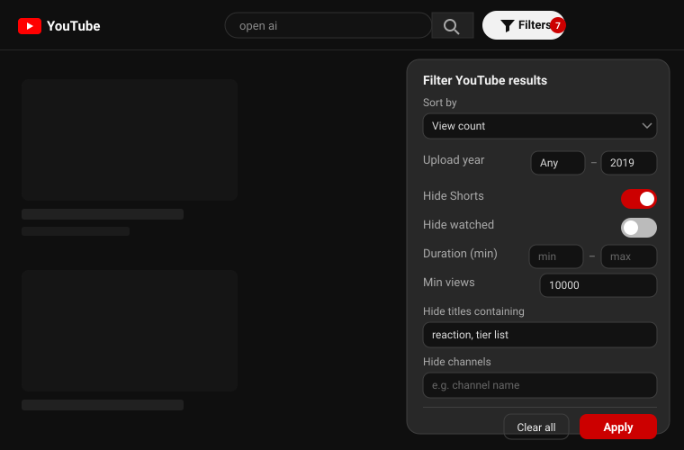

# 🔍 Search Filters for YouTube

> A lightweight Chrome/Edge extension that gives YouTube search the filters it's missing — **sort** results properly, restrict them to an **upload-year range**, and hide **Shorts, watched videos, off-length clips, low-view uploads, and blocked keywords/channels**.


YouTube's built-in filters are coarse and there's no way to say *"only videos up to 2019"*, *"nothing under 10 min"*, or *"hide all Shorts."* This extension adds all of that — a small control next to the search bar plus a richer toolbar popup.

**Example:** search `ai` with **up to `2019`** → only AI videos from 2019 or earlier. Turn on **Hide Shorts** and set **min views 10K** → a much cleaner results page.



---

## ✨ Features

- ↕️ **Sort results** — by relevance, upload date, view count, or rating (drives YouTube's own sort, so it reorders *all* results, not just the visible ones).
- 🔎 **Upload-year range** — set a *from* and/or *up to* year, enforced on-page.
- 🩳 **Hide Shorts** — strip Shorts shelves and Shorts videos from search, home, and sidebar.
- 👁️ **Hide watched** — hide videos you've already partly watched (the red progress bar).
- ⏱️ **Duration filter** — hide anything shorter than a min and/or longer than a max (in minutes).
- 📊 **Minimum views** — hide videos below a view-count threshold.
- 🚫 **Keyword & channel blocklists** — hide results whose title contains a word, or from named channels.
- 🔢 **"N hidden" badge** — see how many results were filtered out on the page.
- 🌍 **Translatable** — all UI strings live in `_locales/` (i18n-ready); English included.
- 🎛️ **Two ways in** — an on-page **Filters** button by the search bar and a matching toolbar popup, kept in sync; 🌗 light/dark aware; ♿ keyboard + ARIA.
- 🔒 **Private** — no tracking, no network calls. Settings live in `chrome.storage` only.
- ⚡ **Tiny** — vanilla JS, no dependencies, no build step.

## 🛠 How it works

**Sorting** drives YouTube's own sort through the `sp` search parameter (a base64
protobuf whose first field is the sort order). Because the sort happens on
YouTube's side, it reorders the **entire** result set — not just the cards
currently loaded, which is all a page-level sort could reach.

| Sort | `sp` value |
|---|---|
| Upload date (newest) | `CAI=` |
| View count | `CAM=` |
| Rating | `CAE=` |

**Year range** uses YouTube's undocumented `before:`/`after:` search operators — the extension rewrites your query:

| You search | Range | Rewritten query |
|---|---|---|
| `ai` | up to 2019 | `ai before:2020-01-01` |
| `ai` | from 2015 | `ai after:2014-12-31` |
| `ai` | 2015 – 2019 | `ai after:2014-12-31 before:2020-01-01` |

These are **real YouTube search results** — no scraping, no third-party API.

⚠️ **YouTube does not reliably enforce these operators** — it will happily return a
6-day-old video for `before:2020-01-01`. So the extension also reads each result's
own upload date ("12 years ago") and hides anything certainly outside your range.
The operator narrows the search; the on-page check enforces it. Cards whose date
can't be read are always kept, so nothing is hidden by mistake.

**Hide Shorts / watched / duration / min-views / blocklists** work client-side: the extension reads each result's duration badge, view count, title, channel, and watched-progress and hides the ones that don't match, live as the page loads (no reload). Nothing leaves your browser.

## 📦 Install (unpacked)

1. Download or clone this repo.
2. Open `chrome://extensions` (or `edge://extensions`).
3. Enable **Developer mode** (top-right).
4. Click **Load unpacked** and select this folder.
5. Open YouTube — a **Filters** button appears next to the search bar.

## 🚀 Usage

1. On any YouTube page, click the **Filters** button next to the search bar — a panel opens beneath it.
2. Set any of: **Sort by**, **Upload year** range, **Hide Shorts**, **Hide watched**, **Duration** (min/max minutes), **Minimum views**, and the **keyword / channel blocklists**.
3. Filters that hide results apply **instantly** to the current page. **Sort** and the **year range** need a fresh search, so changing the sort re-runs it immediately and **Apply** re-runs it with the current query.
4. A red **count badge** on the button shows how many results are hidden. **Clear all** resets everything; click outside the panel or press <kbd>Esc</kbd> to close it.

> The panel itself is attached to the page body and positioned under the button, so YouTube's layout can't clip or dismiss it. The toolbar-icon popup offers the same controls and stays in sync.

## 🧪 Tests

```bash
npm install   # jsdom (dev only)
npm test      # runs tools/test.js against a mock YouTube DOM
```

## 📁 Project structure

```
├── manifest.json      # Extension config (Manifest V3)
├── common.js          # Shared logic: storage, query building, parsers
├── content.js         # On-page button/panel, search + DOM filtering
├── styles.css         # Button/panel styling (light/dark)
├── popup.html/js      # Toolbar popup (mirrors the on-page panel)
├── _locales/en/       # Translatable UI strings (i18n)
├── icons/             # 16/32/48/128 px PNG icons
├── docs/preview.svg   # README preview image
├── package.json       # npm test script + jsdom devDependency
└── tools/
    ├── make_icons.py  # Regenerate icons (requires Pillow)
    └── test.js        # jsdom integration test (64 assertions)
```

## 🔧 Development

No build step — edit the files and reload the extension from `chrome://extensions`.

To regenerate icons:

```bash
pip install pillow
python tools/make_icons.py
```

## ⚠️ Notes & limitations

- The `before:`/`after:` operators and the `sp` sort value are **undocumented**, so YouTube can change their behaviour at any time. The year range is enforced on-page as well, so it keeps working even when YouTube ignores the operator.
- Year ranges are inclusive of whole years ("up to 2019" includes all of 2019). Upload dates on result cards are **relative** ("12 years ago"), so each estimate is widened by one unit and a video is hidden only when its entire possible date range falls outside your filter. Cards whose date can't be read are always kept.
- YouTube's view-count sort ranks a set of results it considers relevant — it isn't a global "most viewed on YouTube" ordering.
- The on-page filters read YouTube's rendered markup, so a large YouTube redesign can require selector updates. `npm test` covers this against a mock DOM.

## 🌍 Translations

All UI text lives in [`_locales/en/messages.json`](_locales/en/messages.json). To add a
language, copy that file to `_locales/<code>/messages.json` (e.g. `es`, `hi`, `fr`),
translate each `"message"` value, and open a PR — the extension picks it up from the
browser's language automatically.

## 🤝 Contributing

Issues and PRs welcome! See [CONTRIBUTING.md](CONTRIBUTING.md).

## 📄 License

[MIT](LICENSE) — do whatever you like, just keep the notice.

---

<sub>Not affiliated with YouTube or Google. "YouTube" is a trademark of Google LLC.</sub>
